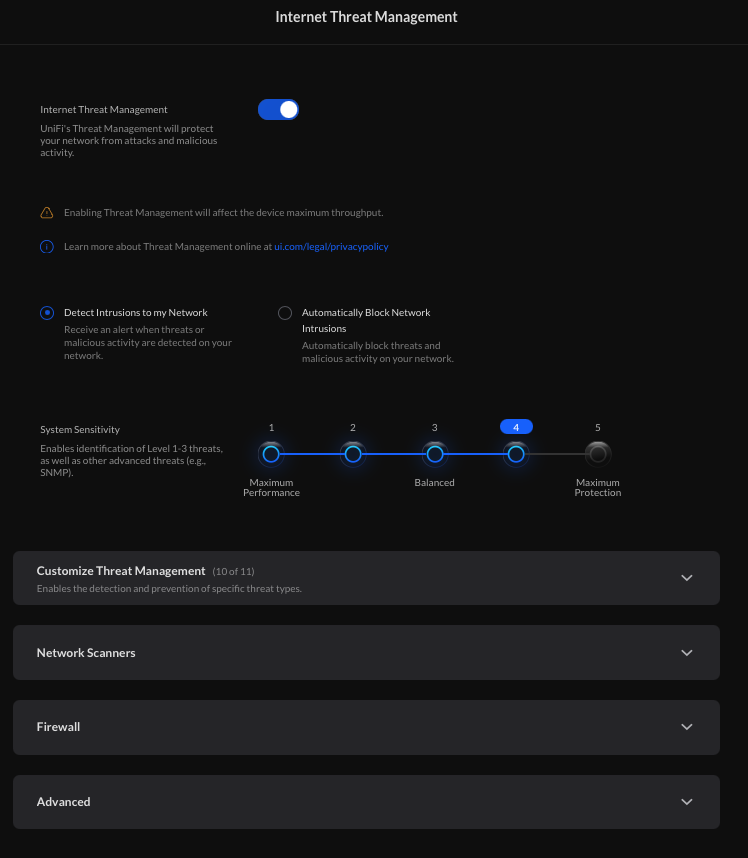
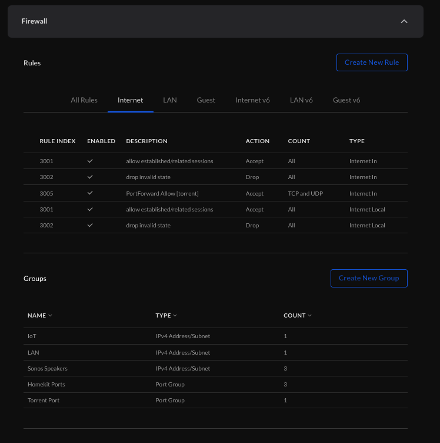
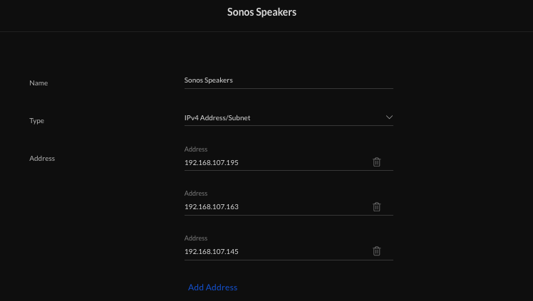
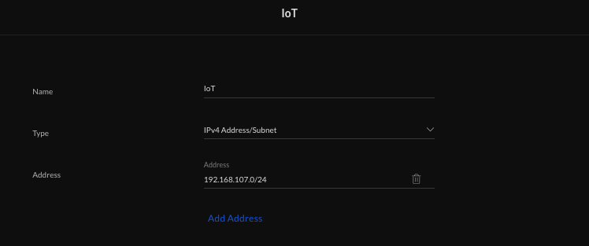
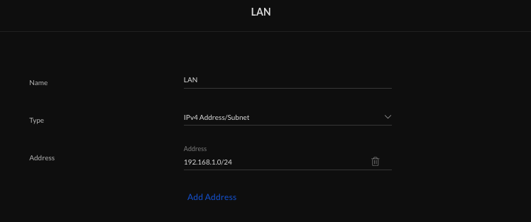

# Firewall Setup

_So, this is a total rewrite on this section based on the feedback from the Unifi Forums - hopefully with the introduction of images and a bit more narrative it will make more sense..If not, let me know._

## Why Do We Need it?

Well, we have gone to the trouble to setup a seperate network for our IoT Devices and as a result of that we may not have the ability to control/access them from our main LAN. The purpose of the firewall is to essentially:
* Drop every communication between VLAN 107 (IoT) and our default VLAN (LAN)
* Except if the following criteria is met:
    * The source is from our Sonos speakers IP Addresses. Note that we use the Sonos IP's as they tend to use so many ports its just easier....
    * The source is from a device using the known Homekit ports as published by Apple
    * The source is an existing connection that we have made from LAN -> IoT (aka a talk-back connection the same way that a webserver/browser works)

If we allow only these communications then we have achieved what we wanted which was to separate out out insecure IoT devices and our main LAN.

> Before we start, confession time. I've been very lazy on how I've set these up. Before a bunch of security professionals start flaming me I'd like to remind them that security is a continuum of ease of use vs secure and I've plonked myself on the convenience side of the fence..

## Setup (note that I am using the 'new' Unifi Interface in v6.2.26)

You can get to the firewall rules at the following address [https://UDMP-IP-ADDRESS/network/default/settings/security/threat-management](https://192.168.1.1/network/default/settings/security/threat-management) or login into the UDM and choose settings/security/firewall.

This will give you the following screen:

Note that here you can see that I have some threat management turned on (topic for another time). The tab you are looking for is the 'Firewall' - click it and it will expand to give a view of the rules and groups that are in place. 

## Groups

Groups are very simply a mechanism to group together collections of related things - either Ports or IP addresses and give them a nice friendly name. It means taht in your rules you can refer to the group name which will keep your rules more descriptive. 

Taking an example - I've said above that I want to allow communication from my Sonos speakers - by using a group I can have a firewall rule that says:

---

Allow any communication from IoT -> LAN for any ***_SONOS Speakers_***

---

..and we can define ***_SONOS Speakers_*** as a group, so if the IP addresses change (or maybe I buy a new speaker) we just have to update the group and suddenly everything is hunky-dory again. 

So, based on our usage we need the following groups established:
* Sonos Speakers
* Homekit Ports
* Our IoT network (makes life easier later)
* Our LAN network (makes life easier later)

To create a group click on the `Create Group` button on the right hand side and use the following information:

### Sonos Speakers
_note that you will need to update the IP addresses to the ones that are relevant to you. Obviously this means that if someone was to spoof my Sonos IP's then they could get through the firewall but if someone is able to spoof an IP inside my network then we've probably got bigger issues_

Then click the `Apply Changes` button at the bottom of the screen

### Homekit Ports

Then click the `Apply Changes` button at the bottom of the screen

### IoT LAN
_note that you will need to update the IP range to the one that is relevant to you, you can find it in the `Networks` menu if you are unsure_

Then click the `Apply Changes` button at the bottom of the screen

### LAN Network
_note that you will need to update the IP range to the one that is relevant to you, you can find it in the `Networks` menu if you are unsure_

Then click the `Apply Changes` button at the bottom of the screen

This should now give you all the groups that you will need when configuring the firewall rules.

## Firewall Rules
<del>Note that all these rules are set on the `LAN IN` section of the Firewall rules:

| Type   | Description                                 | Enabled | Rule Applied               | Action | IPv4Protocol | Match all protocols except for this | Source Type        | IPv4 Address Group | Port Group    | Destination Type   | IPv4 Address Group | Port Group  | Enable logging | Match State New | Match State Established | Match State Invalid | Match State Related | IPSec       |
|--------|---------------------------------------------|---------|----------------------------|--------|--------------|-------------------------------------|--------------------|--------------------|---------------|--------------------|--------------------|-------------|----------------|-----------------|-------------------------|---------------------|---------------------|-------------|
| LAN IN | Sonos                                       | TRUE    | Before Predetermined Rules | Accept | TCP and UDP  | FALSE                               | Address/Port Group | Sonos Speakers     | Any           | Address/Port Group | LAN                | Any         | FALSE          | FALSE           | FALSE                   | FALSE               | FALSE               | Don’t match |
| LAN IN | IoT > Home LAN - Allow existing connections | TRUE    | Before Predetermined Rules | Accept | All          |                                     | Network            | IoT                | IPv4 Subnet   | Network            | LAN                | IPv4 Subnet | FALSE          | FALSE           | TRUE                    | FALSE               | TRUE                | Don’t match |
| LAN IN | Isolate IoT Network                         | TRUE    | Before Predetermined Rules | Drop   | All          |                                     | Network            | IoT                | IPv4 Subnet   | Network            | LAN                | IPv4 Subnet | FALSE          | FALSE           | FALSE                   | FALSE               | FALSE               | Don’t match |
| LAN IN | Homekit                                     | TRUE    | Before Predetermined Rules | Accept | TCP and UDP  | FALSE                               | Address/Port Group | IoT                | Homekit Ports | Address/Port Group | LAN                | Any         | FALSE          | FALSE           | FALSE                   | FALSE               | FALSE               | Don’t match |

This should allow the IoT VLAN to get access to the LAN when needed and allow any LAN-initiated connections to allow pass-through. All we need to do now is to add in a multicast relay so that things that are initiated on the LAN are actively passed through. Unifi does have mDNS but I've not had much luck so I tend to use an externally provided service in the form of a docker container that can be run under Podman on the UDM directly.</del>